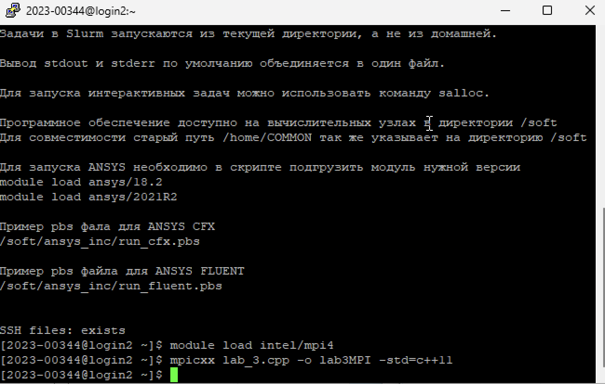
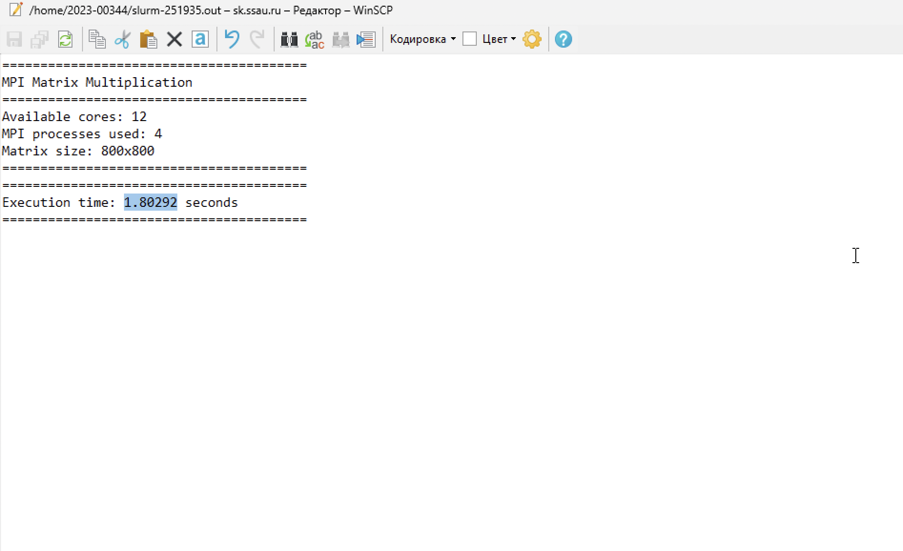
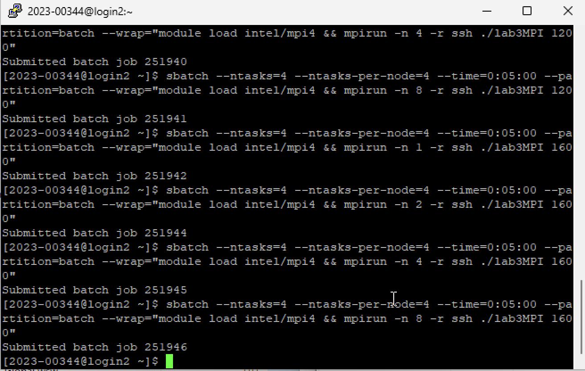
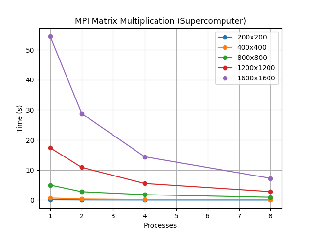

# Лабораторная работа №5

## Параллельное умножение матриц на суперкомпьютере

**Студент:** Абрамов Иван Владиславович\
**Группа:** 6211

------------------------------------------------------------------------

## 📌 Цель работы

Изучение запуска параллельных программ с использованием MPI на
суперкомпьютере "Сергей Королёв".

------------------------------------------------------------------------

## ⚙️ Описание программы

Программа реализует умножение матриц с использованием MPI.

------------------------------------------------------------------------

## 🖥️ Используемые технологии

-   MPI (Intel MPI)
-   SLURM
-   PuTTY
-   WinSCP

------------------------------------------------------------------------

## 🚀 Процесс работы

  

------------------------------------------------------------------------

## 📊 Результаты экспериментов

  Размер      Процессы   Время (сек)
  ----------- ---------- -------------
  200x200     1          0.0822348
  200x200     2          0.0425924
  200x200     4          0.0213436
  200x200     8          0.010952
  400x400     1          0.692844
  400x400     2          0.350373
  400x400     4          0.177486
  400x400     8          0.0936665
  800x800     1          5.00878
  800x800     2          2.78688
  800x800     4          1.80292
  800x800     8          0.930419
  1200x1200   1          17.4047
  1200x1200   2          10.8762
  1200x1200   4          5.53012
  1200x1200   8          2.82599
  1600x1600   1          54.4905
  1600x1600   2          28.8189
  1600x1600   4          14.4186
  1600x1600   8          7.25091

------------------------------------------------------------------------

## 📈 График

------------------------------------------------------------------------

## 🧠 Вывод

MPI эффективно ускоряет вычисления на суперкомпьютере.\
Чем больше размер задачи, тем выше эффективность параллелизма.
