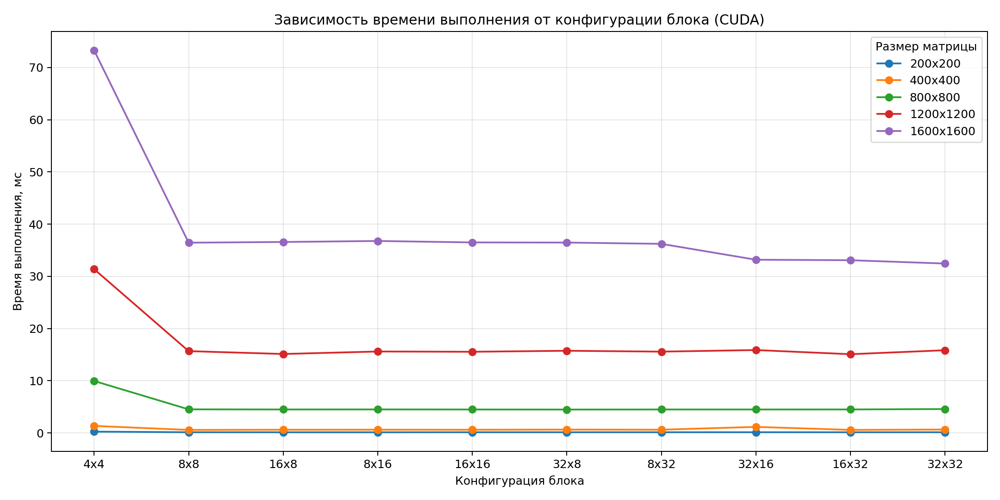
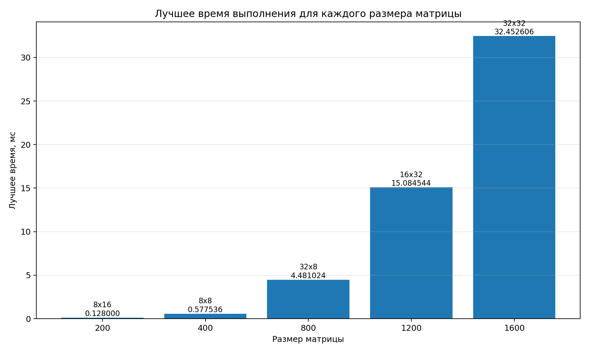

# Лабораторная работа №4

## Параллельное умножение матриц с использованием CUDA

**Студент:** Абрамов Иван Владиславович  
**Группа:** 6211  

---

## Цель работы

Изучение технологии CUDA и реализация параллельного алгоритма умножения матриц на GPU.  
Оценка влияния конфигурации блоков и сетки CUDA на время выполнения программы.

---

## Описание программы

В работе реализовано умножение квадратных матриц размера `N x N` с использованием CUDA.

Основные этапы работы программы:

- чтение матриц из файлов;
- выделение памяти на GPU с помощью `cudaMalloc`;
- копирование данных на устройство с помощью `cudaMemcpy`;
- запуск CUDA kernel для вычисления элементов результирующей матрицы;
- использование двумерной сетки блоков и потоков;
- автоматический перебор нескольких конфигураций блоков;
- измерение времени выполнения с помощью `cudaEventRecord`;
- выбор наилучшей конфигурации по минимальному времени выполнения.

В ходе экспериментов тестировались следующие конфигурации блоков:

`4x4`, `8x8`, `16x8`, `8x16`, `16x16`, `32x8`, `8x32`, `32x16`, `16x32`, `32x32`.

---

## Используемое оборудование

- **Видеокарта:** NVIDIA GeForce RTX 4060
- **Технология параллелизации:** CUDA
- **Измеряемая величина:** время выполнения kernel, мс

---

## Результаты экспериментов

| Размер матрицы | Конфигурация блока | Время выполнения, мс | Статус |
|----------------|--------------------|----------------------|--------|
| 200x200 | 4x4 | 0.248832 | OK |
| 200x200 | 8x8 | 0.132096 | OK |
| 200x200 | 16x8 | 0.129024 | OK |
| 200x200 | 8x16 | 0.128000 | OK |
| 200x200 | 16x16 | 0.133120 | OK |
| 200x200 | 32x8 | 0.133120 | OK |
| 200x200 | 8x32 | 0.134144 | OK |
| 200x200 | 32x16 | 0.134144 | OK |
| 200x200 | 16x32 | 0.131072 | OK |
| 200x200 | 32x32 | 0.132096 | OK |
| 400x400 | 4x4 | 1.343488 | OK |
| 400x400 | 8x8 | 0.577536 | OK |
| 400x400 | 16x8 | 0.612416 | OK |
| 400x400 | 8x16 | 0.618496 | OK |
| 400x400 | 16x16 | 0.611328 | OK |
| 400x400 | 32x8 | 0.642048 | OK |
| 400x400 | 8x32 | 0.619520 | OK |
| 400x400 | 32x16 | 1.157120 | OK |
| 400x400 | 16x32 | 0.582656 | OK |
| 400x400 | 32x32 | 0.651264 | OK |
| 800x800 | 4x4 | 9.951232 | OK |
| 800x800 | 8x8 | 4.517888 | OK |
| 800x800 | 16x8 | 4.495360 | OK |
| 800x800 | 8x16 | 4.503552 | OK |
| 800x800 | 16x16 | 4.491264 | OK |
| 800x800 | 32x8 | 4.481024 | OK |
| 800x800 | 8x32 | 4.492288 | OK |
| 800x800 | 32x16 | 4.493312 | OK |
| 800x800 | 16x32 | 4.498432 | OK |
| 800x800 | 32x32 | 4.574208 | OK |
| 1200x1200 | 4x4 | 31.378431 | OK |
| 1200x1200 | 8x8 | 15.673344 | OK |
| 1200x1200 | 16x8 | 15.124480 | OK |
| 1200x1200 | 8x16 | 15.601664 | OK |
| 1200x1200 | 16x16 | 15.550464 | OK |
| 1200x1200 | 32x8 | 15.742976 | OK |
| 1200x1200 | 8x32 | 15.575040 | OK |
| 1200x1200 | 32x16 | 15.881216 | OK |
| 1200x1200 | 16x32 | 15.084544 | OK |
| 1200x1200 | 32x32 | 15.842304 | OK |
| 1600x1600 | 4x4 | 73.288704 | OK |
| 1600x1600 | 8x8 | 36.449280 | OK |
| 1600x1600 | 16x8 | 36.584450 | OK |
| 1600x1600 | 8x16 | 36.775936 | OK |
| 1600x1600 | 16x16 | 36.500481 | OK |
| 1600x1600 | 32x8 | 36.473858 | OK |
| 1600x1600 | 8x32 | 36.225025 | OK |
| 1600x1600 | 32x16 | 33.185791 | OK |
| 1600x1600 | 16x32 | 33.090561 | OK |
| 1600x1600 | 32x32 | 32.452606 | OK |

---

## Лучшие конфигурации

| Размер матрицы | Лучшая конфигурация блока | Лучшее время, мс |
|----------------|---------------------------|------------------|
| 200x200 | 8x16 | 0.128000 |
| 400x400 | 8x8 | 0.577536 |
| 800x800 | 32x8 | 4.481024 |
| 1200x1200 | 16x32 | 15.084544 |
| 1600x1600 | 32x32 | 32.452606 |

---

## Графики результатов

### 1. Зависимость времени выполнения от конфигурации блока

### 2. Лучшее время выполнения для каждого размера матрицы

---

## Вывод

По результатам экспериментов видно, что производительность CUDA-программы существенно зависит от выбранной конфигурации блока.

Для малых матриц разница между конфигурациями невелика, однако слишком маленькие блоки, например `4x4`, показывают заметно худшие результаты из-за недостаточной загрузки GPU.  
Для матриц среднего и большого размера более эффективными оказываются конфигурации с большим числом потоков в блоке.

В ходе экспериментов были получены следующие лучшие конфигурации:

- для `200x200` — `8x16` (`0.128000` мс);
- для `400x400` — `8x8` (`0.577536` мс);
- для `800x800` — `32x8` (`4.481024` мс);
- для `1200x1200` — `16x32` (`15.084544` мс);
- для `1600x1600` — `32x32` (`32.452606` мс).

Таким образом, использование CUDA позволяет эффективно выполнять операцию умножения матриц на GPU, а подбор параметров сетки и блоков даёт дополнительный выигрыш по времени выполнения.
