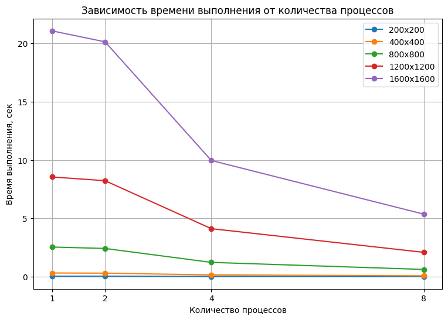

# Лабораторная работа №3

## Параллельное умножение матриц с использованием MPI

**Студент:** Абрамов Иван Владиславович\
**Группа:** 6211

------------------------------------------------------------------------

## Цель работы

Изучение технологии MPI и реализация параллельного алгоритма умножения
матриц.\
Оценка влияния количества процессов на время выполнения программы.

------------------------------------------------------------------------

## Описание программы

Реализовано умножение квадратных матриц размера `N x N` с использованием
MPI.

Основные этапы работы программы:

-   чтение матриц из файлов;
-   распределение строк первой матрицы между процессами с помощью
    `MPI_Scatter`;
-   рассылка второй матрицы всем процессам с помощью `MPI_Bcast`;
-   параллельное вычисление части результирующей матрицы;
-   сбор результата с помощью `MPI_Gather`;
-   измерение времени выполнения.

------------------------------------------------------------------------

## Результаты экспериментов

  Размер матрицы     Количество процессов   Время выполнения, сек
  ---------------- ---------------------- -----------------------
  200x200                               1               0.0389829
  200x200                               2               0.0374644
  200x200                               4               0.0189771
  200x200                               8               0.0098542
  400x400                               1                0.315621
  400x400                               2                0.299884
  400x400                               4                0.153053
  400x400                               8               0.0766022
  800x800                               1                 2.54116
  800x800                               2                 2.41895
  800x800                               4                 1.22548
  800x800                               8                 0.61949
  1200x1200                             1                 8.55213
  1200x1200                             2                 8.23031
  1200x1200                             4                 4.11757
  1200x1200                             8                 2.08728
  1600x1600                             1                 21.0842
  1600x1600                             2                 20.1416
  1600x1600                             4                 9.96551
  1600x1600                             8                 5.36197

------------------------------------------------------------------------

## График результатов

На графике показана зависимость времени выполнения от количества
процессов для всех исследованных размеров матриц.

------------------------------------------------------------------------

## Вывод

По результатам экспериментов видно, что с увеличением количества
процессов время выполнения уменьшается.\
На малых размерах матриц выигрыш выражен слабее, поскольку заметнее
влияние накладных расходов на обмен данными между процессами.\
При увеличении размера матриц эффект распараллеливания становится более
заметным, и использование MPI позволяет существенно сократить время
вычислений.\
Таким образом, технология MPI эффективна для решения задач умножения
матриц большого размера.
