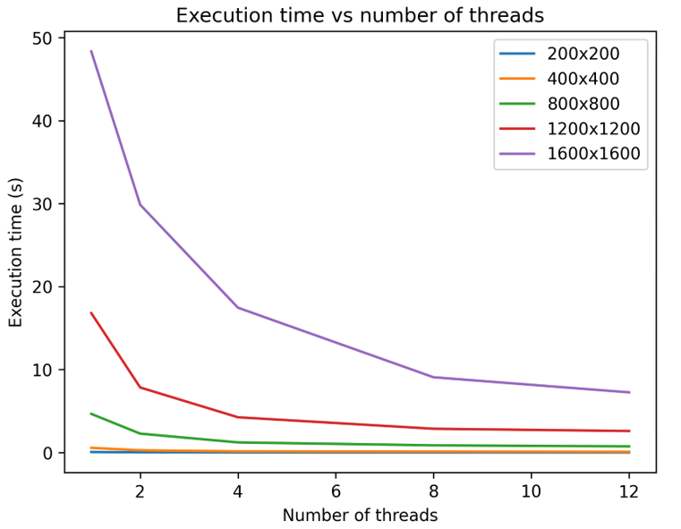
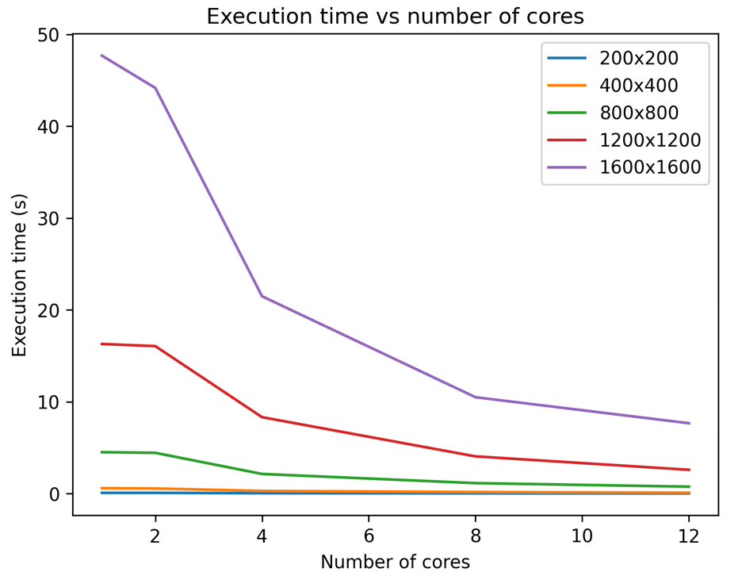
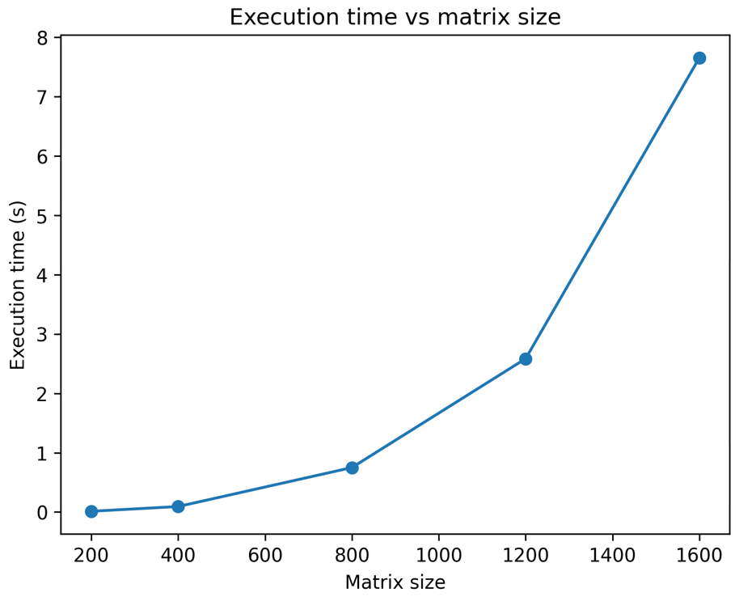

Параллельное перемножение квадратных матриц (OpenMP)

Лабораторная работа по дисциплине Параллельное программирование

Тема: Параллельное перемножение квадратных матриц с использованием OpenMP

Цель работы

Изучить возможности параллельных вычислений при перемножении квадратных матриц, реализовать программу на языке C++ с использованием технологии OpenMP и провести экспериментальное исследование влияния:

числа потоков

числа вычислительных ядер

размера матрицы

на время выполнения программы.

Теоретические сведения

Произведение двух квадратных матриц A и B размера N × N вычисляется по формуле:

𝐶
[
𝑖
]
[
𝑗
]
=
∑
𝑘
=
0
𝑁
−
1
𝐴
[
𝑖
]
[
𝑘
]
×
𝐵
[
𝑘
]
[
𝑗
]
C[i][j]=
k=0
∑
N−1
	​

A[i][k]×B[k][j]

где

A — первая матрица

B — вторая матрица

C — результирующая матрица

Классический алгоритм умножения матриц имеет вычислительную сложность:

𝑂
(
𝑁
3
)
O(N
3
)

Это означает, что время выполнения алгоритма растёт пропорционально кубу размера матрицы.

Для ускорения вычислений используется параллелизация, при которой вычисления распределяются между несколькими потоками.

В работе используется технология OpenMP.

Реализация параллельного алгоритма

Параллелизация выполняется с помощью директивы OpenMP:

#pragma omp parallel for collapse(2)
for (int i = 0; i < n; i++)
    for (int j = 0; j < n; j++) {

        double sum = 0;

        for (int k = 0; k < n; k++)
            sum += A[i][k] * B[k][j];

        C[i][j] = sum;
    }

Директива collapse(2) объединяет два внешних цикла и распределяет итерации между потоками.

Проведённые эксперименты

В ходе работы проводились эксперименты с матрицами следующих размеров:

Размер матрицы
200 × 200
400 × 400
800 × 800
1200 × 1200
1600 × 1600

Исследовалось влияние:

числа потоков

числа вычислительных ядер

размера матрицы

на время выполнения программы.

Результаты экспериментов
Влияние числа потоков
Размер	Ядра	Потоки	Время (сек)
200×200	12	1	0.0689973
200×200	12	2	0.0345304
200×200	12	4	0.0178002
200×200	12	8	0.016204
200×200	12	12	0.011305
400×400	12	1	0.56952
400×400	12	2	0.277088
400×400	12	4	0.15108
400×400	12	8	0.127363
400×400	12	12	0.0935936
800×800	12	1	4.66037
800×800	12	2	2.28243
800×800	12	4	1.22464
800×800	12	8	0.872766
800×800	12	12	0.747108
1200×1200	12	1	16.8011
1200×1200	12	2	7.84412
1200×1200	12	4	4.25248
1200×1200	12	8	2.87015
1200×1200	12	12	2.59865
1600×1600	12	1	48.3359
1600×1600	12	2	29.866
1600×1600	12	4	17.4514
1600×1600	12	8	9.0733
1600×1600	12	12	7.25401
График зависимости времени от числа потоков

Влияние числа вычислительных ядер
Размер	Ядра	Потоки	Время
200×200	1	12	0.0730785
200×200	2	12	0.0747827
200×200	4	12	0.0354391
200×200	8	12	0.0224085
200×200	12	12	0.0130426
400×400	1	12	0.584691
400×400	2	12	0.547126
400×400	4	12	0.287877
400×400	8	12	0.167609
400×400	12	12	0.0931216
800×800	1	12	4.50236
800×800	2	12	4.4323
800×800	4	12	2.13368
800×800	8	12	1.13385
800×800	12	12	0.749743
График зависимости времени от числа ядер

Зависимость времени от размера матрицы
Размер матрицы	Ядра	Потоки	Время
200×200	12	12	0.0130426
400×400	12	12	0.0931216
800×800	12	12	0.749743
1200×1200	12	12	2.585
1600×1600	12	12	7.65562
График зависимости времени от размера матрицы

Сборка проекта
mkdir build
cd build
cmake ..
cmake --build .
Запуск программы

После сборки:

./lab2_matrix_mul

Программа запросит:

число потоков

число используемых ядер

После этого выполнит перемножение матриц и выведет время выполнения.

Вывод

В ходе лабораторной работы был реализован параллельный алгоритм перемножения квадратных матриц с использованием технологии OpenMP.

Экспериментальные результаты показали, что:

увеличение числа потоков уменьшает время выполнения программы

увеличение числа вычислительных ядер также ускоряет вычисления

наибольший эффект параллелизации наблюдается для матриц больших размеров

Для небольших матриц выигрыш от параллельных вычислений невелик из-за накладных расходов на управление потоками.